# Magacin Track WMS - Complete Entity Relationship Diagram

**Document Version:** 1.0  
**Last Updated:** October 19, 2025  
**Database:** PostgreSQL 16

---

## Complete ERD - All Tables

```mermaid
erDiagram
    %% Users & Authentication
    users ||--o{ team : "worker1"
    users ||--o{ team : "worker2"
    users ||--o{ trebovanje : "created_by"
    users ||--o{ trebovanje : "closed_by"
    users ||--o{ zaduznica : "assigned_to"
    users ||--o{ audit_log : "performed"
    users ||--o{ scheduler_log : "suggested"
    users ||--o{ scheduler_log : "actual"
    users ||--o{ scanlog : "scanned_by"
    users ||--o{ import_job : "created_by"
    
    %% Teams
    team ||--o{ zaduznica : "assigned_to_team"
    
    %% Locations
    radnja ||--o{ trebovanje : "destination"
    magacin ||--o{ trebovanje : "source"
    
    %% Catalog
    artikal ||--o{ artikal_barkod : "has_barcodes"
    artikal ||--o{ trebovanje_stavka : "references"
    artikal ||--o{ receipt_item : "references"
    artikal ||--o{ dispatch_item : "references"
    artikal ||--o{ scanlog : "scanned"
    
    %% Documents (Trebovanja)
    trebovanje ||--o{ trebovanje_stavka : "contains"
    trebovanje ||--o{ zaduznica : "converted_to"
    trebovanje ||--o{ scheduler_log : "scheduled"
    
    %% Document Items
    trebovanje_stavka ||--o{ zaduznica_stavka : "assigned_to"
    trebovanje_stavka ||--o{ scanlog : "scanned"
    
    %% Assignments (Zaduznice)
    zaduznica ||--o{ zaduznica_stavka : "contains"
    
    %% Pantheon ERP Integration
    subjects ||--o{ receipt : "supplier"
    subjects ||--o{ receipt : "store"
    subjects ||--o{ dispatch : "warehouse"
    
    doc_types ||--o{ receipt : "document_type"
    doc_types ||--o{ dispatch : "document_type"
    
    receipt ||--o{ receipt_item : "contains"
    dispatch ||--o{ dispatch_item : "contains"
    
    %% Import Jobs
    import_job ||--o{ audit_log : "logged"
    
    %% Catalog Sync
    catalog_sync_status

    %% Table Definitions
    users {
        uuid id PK
        varchar email UK
        varchar first_name
        varchar last_name
        enum role
        varchar hashed_password
        boolean is_active
        timestamp created_at
        timestamp updated_at
    }
    
    team {
        uuid id PK
        varchar name UK
        uuid worker1_id FK
        uuid worker2_id FK
        varchar shift
        boolean active
        timestamp created_at
        timestamp updated_at
    }
    
    radnja {
        uuid id PK
        varchar naziv
        boolean aktivan
        timestamp created_at
        timestamp updated_at
    }
    
    magacin {
        uuid id PK
        varchar naziv
        boolean aktivan
        timestamp created_at
        timestamp updated_at
    }
    
    artikal {
        uuid id PK
        varchar sifra UK
        varchar naziv
        varchar jedinica_mjere
        boolean aktivan
        timestamp created_at
        timestamp updated_at
    }
    
    artikal_barkod {
        uuid id PK
        uuid artikal_id FK
        varchar barkod
        boolean is_primary
    }
    
    trebovanje {
        uuid id PK
        varchar dokument_broj UK
        timestamp datum
        uuid magacin_id FK
        uuid radnja_id FK
        enum status
        jsonb meta
        uuid created_by_id FK
        boolean allow_incomplete_close
        uuid closed_by FK
        timestamp closed_at
        timestamp created_at
        timestamp updated_at
    }
    
    trebovanje_stavka {
        uuid id PK
        uuid trebovanje_id FK
        uuid artikal_id FK
        varchar artikl_sifra
        varchar naziv
        numeric kolicina_trazena
        numeric kolicina_uradjena
        varchar barkod
        enum status
        boolean needs_barcode
        numeric picked_qty
        numeric missing_qty
        enum discrepancy_status
        text discrepancy_reason
        varchar last_scanned_code
    }
    
    zaduznica {
        uuid id PK
        uuid trebovanje_id FK
        uuid magacioner_id FK
        uuid team_id FK
        enum prioritet
        timestamp rok
        enum status
        numeric progress
        timestamp assigned_at
        timestamp started_at
        timestamp completed_at
    }
    
    zaduznica_stavka {
        uuid id PK
        uuid zaduznica_id FK
        uuid trebovanje_stavka_id FK
        numeric trazena_kolicina
        numeric obradjena_kolicina
        enum status
    }
    
    subjects {
        uuid id PK
        varchar code UK
        varchar name
        enum type
        varchar pib
        text address
        varchar city
        varchar postal_code
        varchar country
        varchar phone
        varchar email
        boolean aktivan
        timestamp time_chg_ts
        timestamp last_synced_at
        varchar source
    }
    
    doc_types {
        uuid id PK
        varchar code UK
        varchar name
        enum direction
        boolean aktivan
    }
    
    receipt {
        uuid id PK
        varchar doc_no
        uuid doc_type_id FK
        date date
        uuid supplier_id FK
        uuid store_id FK
        varchar responsible_person
        varchar header_ref
        text notes
        timestamp last_synced_at
    }
    
    receipt_item {
        uuid id PK
        uuid receipt_id FK
        uuid article_id FK
        varchar code
        varchar name
        varchar unit
        varchar barcode
        numeric qty_requested
        numeric qty_completed
        enum status
        text reason_missing
    }
    
    dispatch {
        uuid id PK
        varchar doc_no
        uuid doc_type_id FK
        date date
        uuid warehouse_id FK
        varchar issuer
        varchar receiver
        varchar responsible_person
        varchar header_ref
        text notes
        timestamp last_synced_at
    }
    
    dispatch_item {
        uuid id PK
        uuid dispatch_id FK
        uuid article_id FK
        varchar code
        varchar name
        varchar unit
        varchar barcode
        numeric qty_requested
        numeric qty_completed
        boolean exists_in_wms
        boolean wms_flag
        varchar warehouse_code
        enum status
        text reason_missing
    }
    
    audit_log {
        uuid id PK
        varchar action
        uuid user_id FK
        uuid resource_id
        varchar resource_type
        jsonb details
        timestamp timestamp
    }
    
    scheduler_log {
        uuid id PK
        uuid trebovanje_id FK
        uuid suggested_magacioner_id FK
        uuid actual_magacioner_id FK
        varchar status
        jsonb reasons
        timestamp created_at
    }
    
    import_job {
        uuid id PK
        varchar filename
        enum status
        uuid created_by FK
        jsonb meta
        timestamp started_at
        timestamp finished_at
    }
    
    scanlog {
        uuid id PK
        uuid zaduznica_stavka_id FK
        uuid user_id FK
        varchar barkod
        uuid artikal_id FK
        numeric kolicina
        timestamp scanned_at
    }
    
    catalog_sync_status {
        uuid id PK
        varchar entity_type
        timestamp last_sync_at
        varchar sync_status
        int records_synced
        text error_message
    }
```



---

## Table Details

### Core Tables Summary

| Table | Rows (Est.) | Primary Use | Key Relationships |
|-------|-------------|-------------|-------------------|
| `users` | 10-100 | User accounts & auth | → team, trebovanje, zaduznica |
| `team` | 5-20 | Worker pairs | → users (2x), zaduznica |
| `radnja` | 10-50 | Store locations | → trebovanje |
| `magacin` | 5-20 | Warehouses | → trebovanje |
| `artikal` | 10,000+ | Product catalog | → barkod, stavka |
| `artikal_barkod` | 20,000+ | Barcodes | → artikal |
| `trebovanje` | 1,000+/mo | Demand documents | → stavka, zaduznica |
| `trebovanje_stavka` | 50,000+/mo | Document items | → zaduznica_stavka |
| `zaduznica` | 1,000+/mo | Work assignments | → stavka |
| `zaduznica_stavka` | 50,000+/mo | Assignment items | - |
| `subjects` | 500+ | ERP partners | → receipts, dispatches |
| `doc_types` | 20-50 | Document types | → receipts, dispatches |
| `receipt` | 500+/mo | Inbound docs | → receipt_item |
| `receipt_item` | 10,000+/mo | Receipt items | - |
| `dispatch` | 1,000+/mo | Outbound docs | → dispatch_item |
| `dispatch_item` | 50,000+/mo | Dispatch items | - |
| `audit_log` | Growing | Audit trail | All tables |
| `scheduler_log` | Growing | Scheduling history | → trebovanje |
| `import_job` | Growing | Import history | → audit_log |
| `scanlog` | Growing | Scan history | → stavka, user |
| `catalog_sync_status` | <10 | Sync tracking | - |

**Total Tables:** 20+

---

## Enum Definitions

### User Roles
```sql
CREATE TYPE user_role_enum AS ENUM (
    'admin',           -- Full system access
    'menadzer',        -- Manager - reports & analytics
    'sef',             -- Supervisor - task assignment
    'komercijalista',  -- Sales - view only
    'magacioner'       -- Worker - picking operations
);
```

### Document Status
```sql
CREATE TYPE trebovanje_status AS ENUM (
    'new',             -- Just imported
    'assigned',        -- Assigned to worker/team
    'in_progress',     -- Work started
    'done',            -- Completed
    'failed'           -- Failed/cancelled
);
```

### Item Status
```sql
CREATE TYPE trebovanje_stavka_status AS ENUM (
    'new',             -- Not assigned
    'assigned',        -- Assigned to worker
    'in_progress',     -- Being picked
    'done'             -- Completed
);
```

### Assignment Status
```sql
CREATE TYPE zaduznica_status AS ENUM (
    'assigned',        -- Created, not started
    'in_progress',     -- Worker started
    'done',            -- Completed
    'blocked'          -- Cannot proceed
);
```

### Discrepancy Status ⭐ NEW
```sql
CREATE TYPE discrepancy_status_enum AS ENUM (
    'none',            -- No issues
    'short_pick',      -- Partial quantity
    'not_found',       -- Item not located
    'damaged',         -- Item damaged
    'wrong_barcode'    -- Barcode mismatch
);
```

### Document Item Status
```sql
CREATE TYPE document_item_status_enum AS ENUM (
    'new',             -- Not started
    'in_progress',     -- Being processed
    'completed',       -- Finished
    'cancelled'        -- Cancelled
);
```

### Subject Type ⭐ NEW
```sql
CREATE TYPE subject_type_enum AS ENUM (
    'supplier',        -- Supplier/vendor
    'customer',        -- Customer
    'warehouse'        -- Warehouse/location
);
```

### Document Direction ⭐ NEW
```sql
CREATE TYPE document_direction_enum AS ENUM (
    'inbound',         -- Receipt/incoming
    'outbound'         -- Dispatch/outgoing
);
```

### Import Status
```sql
CREATE TYPE import_status AS ENUM (
    'pending',         -- Queued
    'processing',      -- In progress
    'done',            -- Completed
    'failed'           -- Failed
);
```

---

## Indexes

### Performance-Critical Indexes

```sql
-- Users
CREATE INDEX idx_users_email ON users(email);
CREATE INDEX idx_users_role ON users(role);
CREATE INDEX idx_users_active ON users(is_active);

-- Teams
CREATE INDEX idx_team_name ON team(name);
CREATE INDEX idx_team_shift ON team(shift);
CREATE INDEX idx_team_active ON team(active);
CREATE INDEX idx_team_worker1 ON team(worker1_id);
CREATE INDEX idx_team_worker2 ON team(worker2_id);

-- Catalog
CREATE INDEX idx_artikal_sifra ON artikal(sifra);
CREATE INDEX idx_artikal_aktivan ON artikal(aktivan);
CREATE INDEX idx_barkod_value ON artikal_barkod(barkod);
CREATE INDEX idx_barkod_artikal ON artikal_barkod(artikal_id);

-- Documents
CREATE INDEX idx_trebovanje_broj ON trebovanje(dokument_broj);
CREATE INDEX idx_trebovanje_status ON trebovanje(status);
CREATE INDEX idx_trebovanje_datum ON trebovanje(datum);
CREATE INDEX idx_trebovanje_magacin ON trebovanje(magacin_id);
CREATE INDEX idx_trebovanje_radnja ON trebovanje(radnja_id);
CREATE INDEX idx_trebovanje_created ON trebovanje(created_at);

-- Document Items
CREATE INDEX idx_stavka_trebovanje ON trebovanje_stavka(trebovanje_id);
CREATE INDEX idx_stavka_artikal ON trebovanje_stavka(artikal_id);
CREATE INDEX idx_stavka_status ON trebovanje_stavka(status);
CREATE INDEX idx_stavka_discrepancy ON trebovanje_stavka(discrepancy_status);
CREATE INDEX idx_stavka_sifra ON trebovanje_stavka(artikl_sifra);

-- Assignments
CREATE INDEX idx_zaduznica_trebovanje ON zaduznica(trebovanje_id);
CREATE INDEX idx_zaduznica_worker ON zaduznica(magacioner_id);
CREATE INDEX idx_zaduznica_team ON zaduznica(team_id);
CREATE INDEX idx_zaduznica_status ON zaduznica(status);
CREATE INDEX idx_zaduznica_assigned ON zaduznica(assigned_at);

-- Assignment Items
CREATE INDEX idx_zaduznica_stavka_zaduznica ON zaduznica_stavka(zaduznica_id);
CREATE INDEX idx_zaduznica_stavka_trebovanje ON zaduznica_stavka(trebovanje_stavka_id);

-- Pantheon Tables
CREATE INDEX idx_subject_code ON subjects(code);
CREATE INDEX idx_subject_type ON subjects(type);
CREATE INDEX idx_subject_time_chg ON subjects(time_chg_ts);

CREATE INDEX idx_doctype_code ON doc_types(code);

CREATE INDEX idx_receipt_docno ON receipt(doc_no);
CREATE INDEX idx_receipt_date ON receipt(date);
CREATE INDEX idx_receipt_doctype ON receipt(doc_type_id);

CREATE INDEX idx_receipt_item_receipt ON receipt_item(receipt_id);
CREATE INDEX idx_receipt_item_article ON receipt_item(article_id);
CREATE INDEX idx_receipt_item_code ON receipt_item(code);

CREATE INDEX idx_dispatch_docno ON dispatch(doc_no);
CREATE INDEX idx_dispatch_date ON dispatch(date);
CREATE INDEX idx_dispatch_doctype ON dispatch(doc_type_id);

CREATE INDEX idx_dispatch_item_dispatch ON dispatch_item(dispatch_id);
CREATE INDEX idx_dispatch_item_article ON dispatch_item(article_id);
CREATE INDEX idx_dispatch_item_code ON dispatch_item(code);
CREATE INDEX idx_dispatch_item_wms ON dispatch_item(exists_in_wms);
CREATE INDEX idx_dispatch_item_warehouse ON dispatch_item(warehouse_code);

-- Audit & Logs
CREATE INDEX idx_audit_user ON audit_log(user_id);
CREATE INDEX idx_audit_timestamp ON audit_log(timestamp);
CREATE INDEX idx_audit_resource ON audit_log(resource_type, resource_id);

CREATE INDEX idx_scanlog_stavka ON scanlog(zaduznica_stavka_id);
CREATE INDEX idx_scanlog_user ON scanlog(user_id);
CREATE INDEX idx_scanlog_time ON scanlog(scanned_at);
```

---

## Constraints

### Check Constraints

```sql
-- Trebovanje Stavka
ALTER TABLE trebovanje_stavka
ADD CONSTRAINT kolicina_trazena_gt_zero
CHECK (kolicina_trazena > 0);

ALTER TABLE trebovanje_stavka
ADD CONSTRAINT kolicina_uradjena_le_trazena
CHECK (kolicina_uradjena <= kolicina_trazena);

-- Zaduznica Stavka
ALTER TABLE zaduznica_stavka
ADD CONSTRAINT trazena_kolicina_gt_zero
CHECK (trazena_kolicina > 0);

ALTER TABLE zaduznica_stavka
ADD CONSTRAINT obradjena_le_trazena
CHECK (obradjena_kolicina <= trazena_kolicina);

-- Zaduznica
ALTER TABLE zaduznica
ADD CONSTRAINT progress_between_0_and_100
CHECK (progress >= 0 AND progress <= 100);

-- Team
ALTER TABLE team
ADD CONSTRAINT different_workers
CHECK (worker1_id != worker2_id);

ALTER TABLE team
ADD CONSTRAINT valid_shift
CHECK (shift IN ('A', 'B'));
```

### Foreign Key Constraints (with Cascades)

```sql
-- Trebovanje
ALTER TABLE trebovanje_stavka
ADD CONSTRAINT fk_stavka_trebovanje
FOREIGN KEY (trebovanje_id)
REFERENCES trebovanje(id)
ON DELETE CASCADE;

-- Zaduznica
ALTER TABLE zaduznica_stavka
ADD CONSTRAINT fk_zaduznica_stavka_zaduznica
FOREIGN KEY (zaduznica_id)
REFERENCES zaduznica(id)
ON DELETE CASCADE;

-- Receipt & Dispatch
ALTER TABLE receipt_item
ADD CONSTRAINT fk_receipt_item_receipt
FOREIGN KEY (receipt_id)
REFERENCES receipt(id)
ON DELETE CASCADE;

ALTER TABLE dispatch_item
ADD CONSTRAINT fk_dispatch_item_dispatch
FOREIGN KEY (dispatch_id)
REFERENCES dispatch(id)
ON DELETE CASCADE;
```

---

## Database Size Estimates

### Storage Requirements (1 Year)

| Table | Row Size | Rows/Year | Storage |
|-------|----------|-----------|---------|
| users | 500 B | 100 | 50 KB |
| team | 300 B | 20 | 6 KB |
| radnja | 200 B | 50 | 10 KB |
| magacin | 200 B | 20 | 4 KB |
| artikal | 400 B | 15,000 | 6 MB |
| artikal_barkod | 150 B | 30,000 | 4.5 MB |
| trebovanje | 600 B | 12,000 | 7.2 MB |
| trebovanje_stavka | 500 B | 600,000 | 300 MB |
| zaduznica | 400 B | 12,000 | 4.8 MB |
| zaduznica_stavka | 300 B | 600,000 | 180 MB |
| subjects | 800 B | 1,000 | 800 KB |
| receipt | 500 B | 6,000 | 3 MB |
| receipt_item | 400 B | 120,000 | 48 MB |
| dispatch | 500 B | 12,000 | 6 MB |
| dispatch_item | 450 B | 600,000 | 270 MB |
| audit_log | 600 B | 1,000,000 | 600 MB |
| scanlog | 300 B | 600,000 | 180 MB |
| scheduler_log | 400 B | 12,000 | 4.8 MB |
| import_job | 500 B | 500 | 250 KB |

**Total Estimated:** ~1.6 GB (data + indexes)

---

## Backup Strategy

### Recommended Backup Schedule

**Full Backup:** Daily at 3 AM
```bash
pg_dump -U wmsops -Fc wmsops_local > backup_$(date +%Y%m%d).dump
```

**Incremental Backup:** Every 6 hours (WAL archiving)
```bash
# Enable WAL archiving in postgresql.conf
archive_mode = on
archive_command = 'cp %p /backups/wal/%f'
```

**Retention:** 30 days

---

## Migration History

| Migration | Date | Description |
|-----------|------|-------------|
| `2024050501_initial_schema.py` | 2024-05-05 | Initial database schema |
| `2024050601_scheduler_log.py` | 2024-05-06 | Add scheduler logging |
| `002_add_team_model.py` | 2024-10-01 | ⭐ Team model for pairs |
| `003_add_shortage_tracking.py` | 2024-10-05 | ⭐ Shortage tracking fields |
| `2024120101_user_management_rbac.py` | 2024-12-01 | RBAC implementation |
| `2025101701_pantheon_erp_integration.py` | 2025-10-17 | ⭐ Pantheon ERP models |

---

## Query Examples

### Get Team Performance
```sql
SELECT 
    t.name AS team_name,
    u1.first_name || ' ' || u1.last_name AS worker1,
    u2.first_name || ' ' || u2.last_name AS worker2,
    COUNT(z.id) AS tasks_completed,
    AVG(EXTRACT(EPOCH FROM (z.completed_at - z.assigned_at))/60) AS avg_time_minutes
FROM team t
JOIN users u1 ON t.worker1_id = u1.id
JOIN users u2 ON t.worker2_id = u2.id
JOIN zaduznica z ON z.team_id = t.id
WHERE z.status = 'done'
    AND z.completed_at >= NOW() - INTERVAL '7 days'
GROUP BY t.id, t.name, u1.id, u2.id
ORDER BY tasks_completed DESC;
```

### Shortage Report
```sql
SELECT 
    treb.dokument_broj,
    treb.datum,
    r.naziv AS radnja,
    m.naziv AS magacin,
    ts.artikl_sifra,
    ts.naziv,
    ts.kolicina_trazena AS required,
    ts.picked_qty AS picked,
    ts.missing_qty AS missing,
    ts.discrepancy_status,
    ts.discrepancy_reason,
    u.first_name || ' ' || u.last_name AS worker,
    treb.closed_at
FROM trebovanje_stavka ts
JOIN trebovanje treb ON ts.trebovanje_id = treb.id
JOIN radnja r ON treb.radnja_id = r.id
JOIN magacin m ON treb.magacin_id = m.id
LEFT JOIN zaduznica z ON z.trebovanje_id = treb.id
LEFT JOIN users u ON z.magacioner_id = u.id
WHERE ts.discrepancy_status != 'none'
    AND treb.status = 'done'
    AND treb.closed_at >= DATE_TRUNC('month', NOW())
ORDER BY treb.closed_at DESC;
```

### Worker Leaderboard
```sql
SELECT 
    u.first_name || ' ' || u.last_name AS worker,
    COUNT(DISTINCT z.id) AS tasks_completed,
    SUM(zs.obradjena_kolicina) AS total_items_picked,
    AVG(EXTRACT(EPOCH FROM (z.completed_at - z.started_at))/60) AS avg_task_time_min
FROM users u
JOIN zaduznica z ON u.id = z.magacioner_id
JOIN zaduznica_stavka zs ON z.id = zs.zaduznica_id
WHERE u.role = 'magacioner'
    AND z.status = 'done'
    AND z.completed_at >= NOW() - INTERVAL '30 days'
GROUP BY u.id, u.first_name, u.last_name
ORDER BY total_items_picked DESC
LIMIT 10;
```

---

## Conclusion

This ERD represents a **comprehensive warehouse management database** with:

✅ **20+ tables** properly normalized  
✅ **Clear relationships** between entities  
✅ **Proper constraints** for data integrity  
✅ **Performance indexes** on key columns  
✅ **Pantheon ERP integration** (subjects, receipts, dispatches)  
✅ **Team-based operations** (new feature)  
✅ **Shortage tracking** (new feature)  
✅ **Audit trail** for compliance  

The database is **production-ready** and designed for scalability.

---

**Document Version:** 1.0  
**Database Version:** PostgreSQL 16  
**Last Updated:** October 19, 2025


