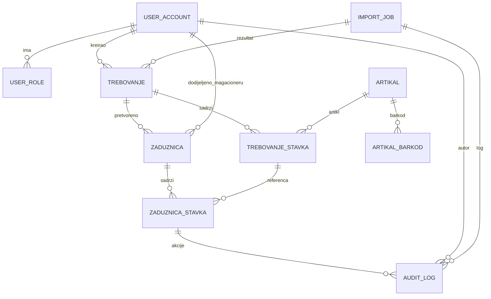

# ERD — Interni WMS Operativni Sloj (Sprint 1)

## Ključne tabele

- `user_account` — korisnici sistema (ime, email, hash lozinke, aktivan, role flag).
- `user_role` — dodjela uloga (`komercijalista`, `sef`, `magacioner`, `menadzer`).
- `trebovanje` — zaglavlje importovanog dokumenta iz Pantheona.
- `trebovanje_stavka` — artikli i količine iz dokumenta.
- `zaduznica` — zadatak dodijeljen konkretnom magacioneru.
- `zaduznica_stavka` — stavke zadatka (mapirane na `trebovanje_stavka`).
- `artikal` — master podatak o artiklu (šifra, naziv, jedinica mjere).
- `artikal_barkod` — lista barkodova vezanih za artikal (primarni + alternativni).
- `audit_log` — sve značajne radnje (import, assign, reassign, scan, manual complete).
- `import_job` — metapodatak o fajlu koji je uvezen (status, hash, poruka greške).

## Relacije (Mermaid)

## Struktura tabela (sa ograničenjima)

- `user_account`
  - `id` UUID PK
  - `email` (unique)
  - `full_name`
  - `password_hash`
  - `is_active` bool
  - `created_at`

- `user_role`
  - `id` UUID PK
  - `user_id` FK → `user_account.id`
  - `role` ENUM (`komercijalista`, `sef`, `magacioner`, `menadzer`)

- `trebovanje`
  - `id` UUID PK
  - `dokument_broj` unique, indexed
  - `datum`
  - `magacin_id`
  - `radnja_id`
  - `status` ENUM (`new`, `assigned`, `in_progress`, `done`, `failed`)
  - `meta` JSONB
  - `created_by` FK → `user_account.id`
  - `created_at`

- `trebovanje_stavka`
  - `id` UUID PK
  - `trebovanje_id` FK → `trebovanje.id`
  - `artikal_id` FK → `artikal.id`
  - `artikl_sifra`
  - `naziv`
  - `kolicina_trazena` NUMERIC(12,3) CHECK `> 0`
  - `kolicina_uradjena` NUMERIC(12,3) DEFAULT 0 CHECK `kolicina_uradjena <= kolicina_trazena`
  - `status` ENUM (`new`, `assigned`, `in_progress`, `done`)

- `zaduznica`
  - `id` UUID PK
  - `trebovanje_id` FK → `trebovanje.id`
  - `magacioner_id` FK → `user_account.id`
  - `prioritet` ENUM (`low`, `normal`, `high`)
  - `rok`
  - `status` ENUM (`assigned`, `in_progress`, `done`, `blocked`)
  - `progress` NUMERIC(5,2)
  - `created_at`

- `zaduznica_stavka`
  - `id` UUID PK
  - `zaduznica_id` FK → `zaduznica.id`
  - `trebovanje_stavka_id` FK → `trebovanje_stavka.id`
  - `trazena_kolicina` NUMERIC(12,3) CHECK `> 0`
  - `obradjena_kolicina` NUMERIC(12,3) CHECK `obradjena_kolicina <= trazena_kolicina`
  - `status` ENUM (`assigned`, `in_progress`, `done`)

- `artikal`
  - `id` UUID PK
  - `sifra` unique
  - `naziv`
  - `jedinica_mjere`

- `artikal_barkod`
  - `id` UUID PK
  - `artikal_id` FK → `artikal.id`
  - `barkod`
  - `is_primary` bool

- `audit_log`
  - `id` UUID PK
  - `actor_id` FK → `user_account.id`
  - `action`
  - `entity_type`
  - `entity_id`
  - `payload` JSONB
  - `created_at`

- `import_job`
  - `id` UUID PK
  - `file_name`
  - `hash`
  - `status` ENUM (`pending`, `processing`, `done`, `failed`)
  - `error`
  - `started_at`
  - `finished_at`
  - `initiated_by` FK → `user_account.id`

> ERD služi kao ulaz za Alembic migracije u Sprintu 1 i pokriva definicije iz Definition of Done.
